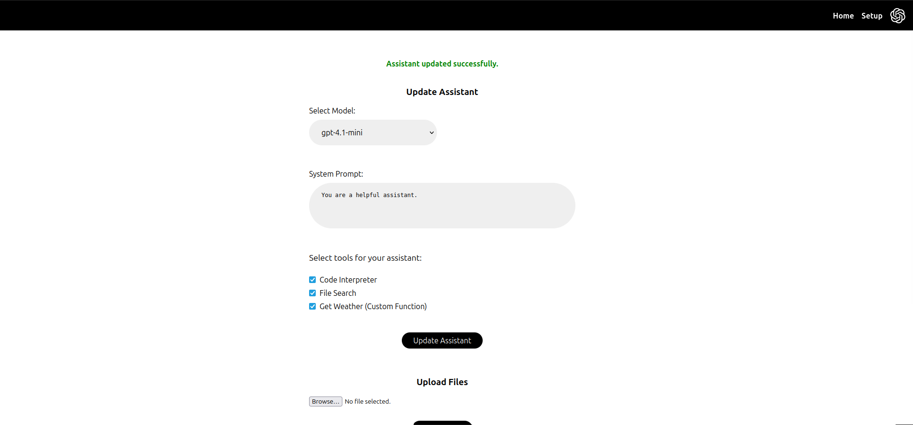
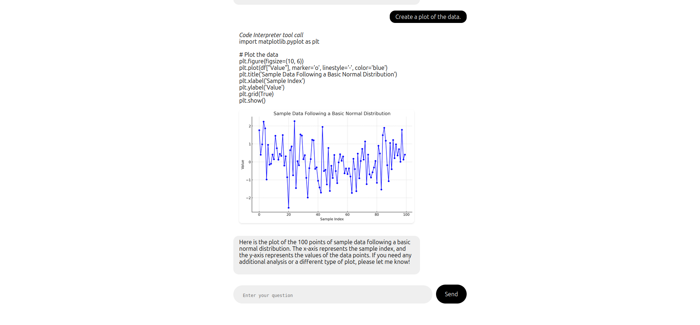
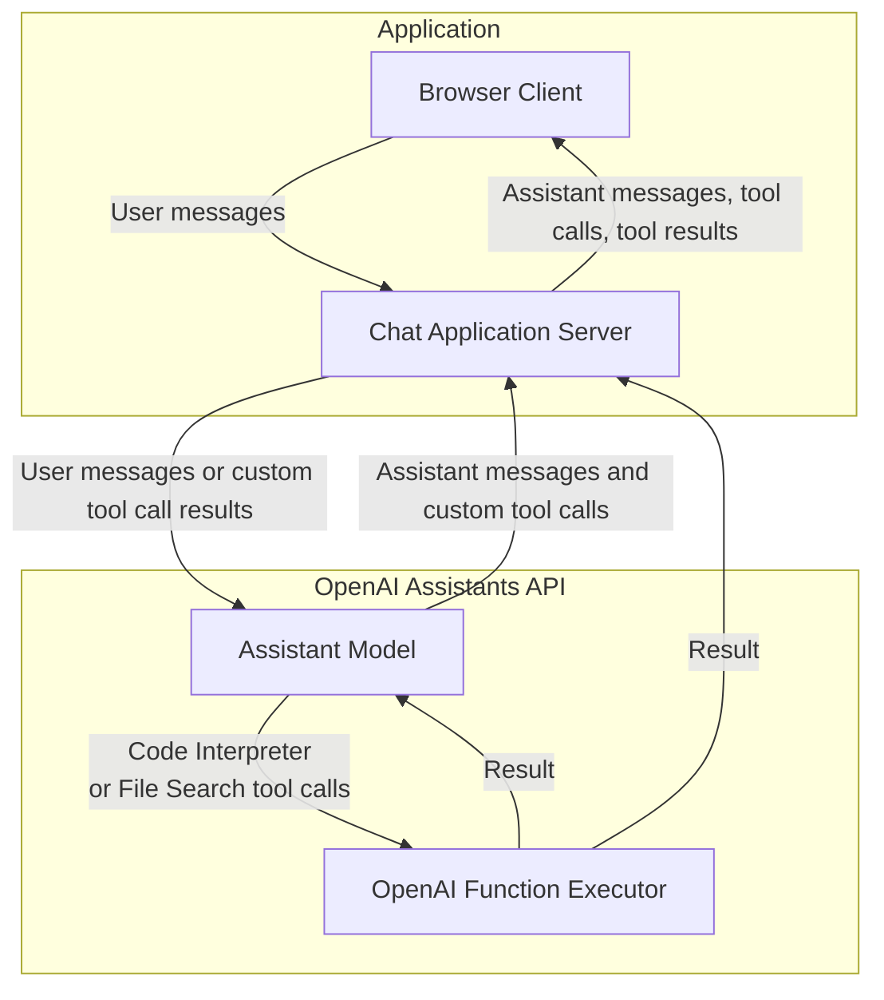

# OpenAI Assistants API Quickstart with Python, Jinja2, FastAPI, and HTMX

A quick-start template using the OpenAI [Assistants API](https://platform.openai.com/docs/assistants/overview) with [Python](https://www.python.org/), [FastAPI](https://fastapi.tiangolo.com/), [Jinja2](https://jinja.palletsprojects.com/en/3.1.x/), and [HTMX](https://htmx.org/).

## Quickstart Setup

### 1. Clone repo

```shell
git clone https://github.com/Promptly-Technologies-LLC/openai-assistants-python-quickstart.git
cd openai-assistants-python-quickstart
```

### 2. Install dependencies

```shell
uv sync
```

### 3. Run the FastAPI server

```shell
uv run uvicorn main:app --host 0.0.0.0 --port 8000 --reload
```

### 4. Navigate to [http://localhost:8000](http://localhost:8000).

### 5. Set your OpenAI API key and create an assistant in the GUI

## Usage

Navigate to the `/setup` page at any time to configure your assistant:



Navigate to the `/chat` page to begin a chat session:



If your OPENAI_API_KEY or ASSISTANT_ID are not set, you will be redirected to `/setup` where you can set them. (The values will be saved in a `.env` file in the root of the project.)

The assistant is capable of multi-step workflows involving multiple chained tool calls, including file searches, code execution, and calling custom functions. Tool calls will be displayed in the chat as they are processed.

## Architecture

When the user client sends a message to the application server, the server forwards the message to the OpenAI Assistants API. The assistant can reply with either a message to the user (which the server simply forwards to the client) or a tool call (which must be executed before the assistant can proceed with the conversation).

The Assistants API supports three types of tool calls:

- Code Interpreter
- File Search
- Custom functions

Code Interpreter and File Search tool calls are executed on OpenAI's servers, while custom functions are executed on the application server.

For custom function calls, the assistant will send the application server a JSON object with the function name and arguments (which the application server forwards to the user client for visibility). The application server will then execute the function and return the result to both the assistant and the client. The assistant will then respond to the application server with either another tool call or a final message to the user interpreting the results, which the server forwards to the client.



## Defining Your Own Custom Functions

Define custom functions in the `utils/custom_functions.py` file. An example `get_weather` function is provided. You will need to import your function in `routers/chat.py` and add your execution logic to the `event_generator` function (search for `get_weather` in that file to see a function execution example). See also `templates/components/weather-widget.html` for an example widget for displaying the function call results.

Ultimately I plan to support a more intuitive workflow for defining custom functions, and perhaps I'll even add MCP support. Please contribute a PR if you'd like to help!
