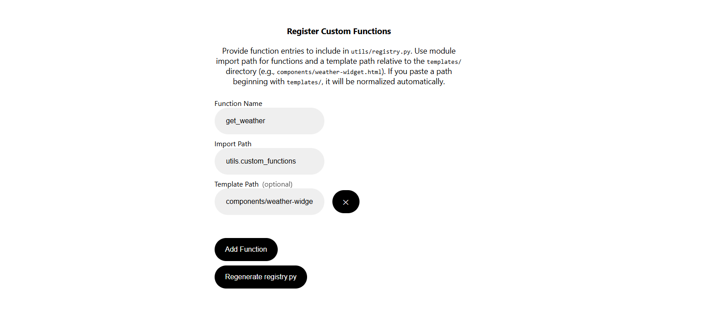

# OpenAI Responses API Quickstart with Python, Jinja2, FastAPI, and HTMX

A quick-start template using the OpenAI [Responses API](https://platform.openai.com/docs/api-reference/responses) with [Python](https://www.python.org/), [FastAPI](https://fastapi.tiangolo.com/), [Jinja2](https://jinja.palletsprojects.com/en/3.1.x/), and [HTMX](https://htmx.org/). Forked from [openai-assistants-python-quickstart](https://github.com/Promptly-Technologies-LLC/openai-assistants-python-quickstart) after the recent deprecation of the Assistants API.

## What's New?

The main high-level architectural difference between the two APIs is that you now must store your assistant's configuration, such as its tools and instructions, in local storage rather than on OpenAI's servers. This makes it easier to swap out the tool set mid-conversation. The new API also allows for easier forking of conversations; it still offers stateful conversation storage, but you can edit the history or manage the state locally if you wish.

Lower-level feature improvements include:

- A native web search tool
- A native image generation tool
- A computer use tool
- Support for calling tools via remote MCP servers
- Support for more models

Note that most of the new features are not yet implemented in this repo.

## Quickstart Setup

### 1. Clone repo

```shell
git clone https://github.com/Promptly-Technologies-LLC/openai-responses-python-quickstart.git
cd openai-responses-python-quickstart
```

### 2. Install dependencies

```shell
uv sync
```

### 3. Run the FastAPI server

```shell
uv run uvicorn main:app --reload
```

### 4. Navigate to [http://localhost:8000](http://localhost:8000).

### 5. Set your OpenAI API key and configure your assistant in the GUI

## Usage

Navigate to the `/setup` page at any time to configure your assistant:


Navigate to the `/chat` page to begin a chat session:


If your OPENAI_API_KEY is not set, you will be redirected to `/setup` where you can set it. (The value will be saved in a `.env` file in the root of the project.) Similarly, if your assistant is not configured, you will be redirected to `/setup` to configure it.

The assistant is capable of multi-step workflows involving multiple chained tool calls, including file searches, code execution, and calling custom functions. Tool calls will be displayed in the chat as they are processed.

## Architecture

When the user client sends a message to the application server, the server forwards the message to the OpenAI Responses API. The assistant can reply with either a message to the user (which the server simply forwards to the client) or a tool call (which must be executed before the assistant can proceed with the conversation).

The Responses API supports seven types of tool calls:

- Code Interpreter
- Computer use
- Custom functions
- File search
- Image generation
- MCP tools
- Web search

Code Interpreter, file search, image generation, and web search tool calls are executed on OpenAI's servers, while computer use, custom function, and MCP tool calls are executed on the application server.

For custom function calls, the assistant will send the application server a JSON object with the function name and arguments (which the application server forwards to the user client for visibility). The application server will then execute the function and return the result to both the assistant and the client. The assistant will then respond to the application server with either another tool call or a final message to the user interpreting the results, which the server forwards to the client.


## Defining Custom Functions

Define a custom Python function in a file in the `utils` folder. The function should take serializable input types and return a serializable output type. Ideally, you should annotate each field with a description using `typing.Annotated` and `pydantic.Field`, since these descriptions are provided to the assistant. The assistant will also be provided the function docstring. An example `get_weather` function is provided in the `utils/custom_functions.py`.

Optionally, you can define a custom HTML template in a file in the `templates/components` folder. If a template is provided, function call results will be rendered with the template in the chat UI. The template should take a single `tool` input of the `FunctionResult` type:

```python
class FunctionResult(BaseModel, Generic[T]):
    error: Optional[str] = None
    warning: Optional[str] = None
    result: Optional[T] = None
```

The template should handle both the result case (to display the function call results to the end-user) and the error case (to alert the user that the function call failed). Handling the warning case is optional.

An example `weather-widget.html` template is provided in the `templates/components` folder.

After defining your function (and optionally a template), start the server and navigate to the `/setup` page to register your function and template.



Don't forget to click "Regenerate tool.config.json" to save your changes. (This will regenerate the `tool.config.json` file with your new configuration.)
